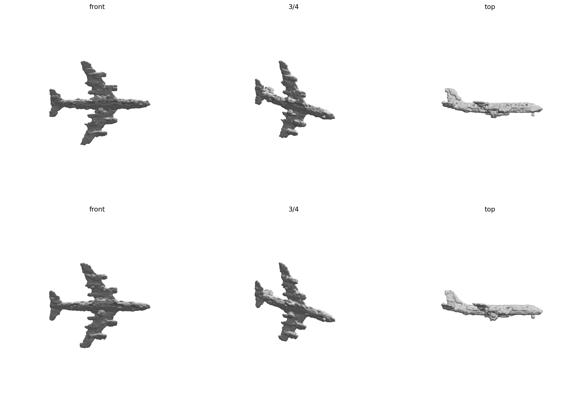
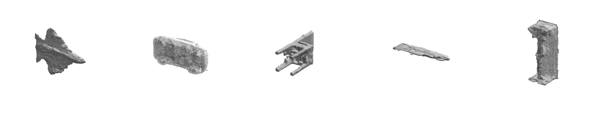

# PKU-3Dfractalgeneration: 基于 VQ-VAE 的由粗到细八叉树三维形状生成

北京大学《几何计算前沿》课程期末项目。核心研究问题：

> 一个**单次前向（约 4 次 forward）**的由粗到细八叉树生成器，能否逼近 OctGPT 这类迭代自回归模型（约 576 次前向）的形状质量？

我们复用 OctGPT 完全相同的冻结 VQ-VAE 作为叶子解码器，只把生成器换成由粗到细、少步前向的结构，使质量差异可以干净地归因到生成器本身。

| 方法 | 前向次数/样本 | 生成器耗时 | 端到端（含 marching cubes） |
|---|---|---|---|
| OctGPT（官方权重，实测） | ~576 | ~77 s | ~81 s |
| 本方法 | **~4** | **~0.23 s** | ~3.8 s |

同一台 A100、同一冻结 VQ-VAE、res=256。生成器部分约 300 倍加速，端到端约 21 倍（瓶颈是两者共享的 marching cubes）。

完整技术报告见 [`report/final_ydg.pdf`](report/final_ydg.pdf)。

## 方法概览

生成器只负责预测八叉树结构与叶子层的 VQ token，解码交给冻结的 VQ-VAE：

```
逐层预测 split → 展开到 depth_stop=6 → 叶子层预测 VQ token
    → 冻结 VQ-VAE 解码为 SDF → marching cubes 得到网格
```

- **由粗到细 split 预测**：从 `full_depth=3` 起，用 OctFormer 逐层预测每个节点是否分裂，展开至 `depth_stop=6`，再由 zero split 扩到 `depth=8`。
- **叶子层 VQ token + 冻结解码器**：叶子层预测离散 VQ token，由冻结 VQ-VAE 解码为连续 SDF，表面细节强于纯占据表示。
- **条件化**：类别嵌入 + VAE 隐变量 `z`（训练时由真值形状编码，生成时从 `N(0, I)` 采样），每一层注入；条件权重 zero-init，保证 warm-start 等价性。
- **sibling attention**：同一父节点展开出的 8 个子节点互相 attend，改善 split 预测。
- **split 监督**：split=1 极度稀疏，用 Focal Loss；训练为 teacher forcing。

## 主要结果

**单飞机过拟合**：split accuracy 收敛到 0.998，与"真值 token 送回同一冻结 VQ-VAE"的 oracle 上限对照几乎一致（平均二面角 13.2° vs 14.0°），即约 4 次前向的生成器达到了解码器自身的重建上限。早期网格满布小孔的元凶是 marching cubes 等值面 0.002 落在 SDF 零点噪声带内，提高到 0.01 免费修复，无需重训练。



**im-5 多类别**（airplane / car / chair / rifle / table）：无条件模型生成严重趋同；条件化（C2/V1）是关键修复，扩容与 sibling attention（Q2/Q4）小幅增益，全层 split-MaskGIT（Q3）为负结果。逐层 recall 诊断发现瓶颈在最粗层（depth-3 漏分裂率 21.4%，逐层级联后 depth-6 叶子缺失 29.3%）；R2 用粗层加权 loss + 空间池化 latent 把它压到 1.7%（结构 IoU 0.33 → 0.56），代价是细层查准率下降的"宁多勿漏"张力。详见 [`experiments/RESULTS.md`](experiments/RESULTS.md) 与报告第 4、5 节。



**根本限制**：单次前向对每个节点按独立边缘概率判决，多模式布局被平均成"类别平均形状"（如飞机的三角翼团块）。最有希望的后续方向是仅在 depth-3（≤512 节点）做 4–8 步迭代 refinement，总前向仍 ~12 次、保持约 50 倍生成器加速。

## 仓库结构

```
.
├── main_fractal.py                 # 训练/生成入口（VQ-VAE 版）
├── render_obj.py                   # headless 渲染 .obj → 三视图 PNG
├── fractal_models/
│   └── fractal_generator.py        # FractalGenerator（focal loss + 阈值 split + 条件化）
├── configs/
│   ├── shapenet_fractal.yaml       # 单飞机 overfit config
│   ├── shapenet_frac_im5.yaml      # im-5 多类别基础 config
│   └── exp/                        # 全部实验 config（E0-E9 / C / V / Q / S / R 系列）
├── eval/
│   ├── gen_from_ckpt.py            # 从 ckpt 批量生成（--temperature / --mc_level）
│   ├── diag_split.py               # 逐层 split recall/precision 结构诊断
│   ├── eval_fractal.py             # MMD-CD / COV / 1-NNA
│   ├── bench_speed.py              # 与 OctGPT 的推理速度对比
│   └── vqvae_ceiling*.py           # oracle（解码器上限）对照
├── scripts/                        # 实验队列 shell 脚本
├── experiments/RESULTS.md          # 实验结果总表 + 空洞诊断记录
├── without_VQVAE/                  # 不带 VQ-VAE 的对照实现
├── report/                         # 期末报告（PDF + LaTeX 源码 + 图）
├── FRACTAL_IMPROVEMENT_PLAN.md     # v5 改进实验设计
└── SUBMISSION.md                   # 提交清单（权重路径、复现命令速查）
```

`octgpt/`、`data/`、`logs/`、`saved_ckpt/` 均不入库（.gitignore）。

## 环境配置

```bash
conda create -n fractal python=3.10 -y
conda activate fractal
pip install torch torchvision ocnn tqdm

# OctGPT 是运行时依赖，克隆到仓库根目录下（main_fractal.py 从 ./octgpt 导入）
git clone https://github.com/octree-nn/octgpt.git octgpt
pip install -r octgpt/requirements.txt
```

### 预训练权重

全部权重来自 HuggingFace [`wst2001/OctGPT`](https://huggingface.co/wst2001/OctGPT)（即 OctGPT README 2.1 节的官方发布），下载后放到 `saved_ckpt/`：

| 文件 | 用途 |
|---|---|
| `vqvae_large_im5_uncond_bsq32.pth` | **必需**。冻结 VQ-VAE，本方法整条 pipeline 的解码器，config 中由 `vqvae_ckpt` 字段指定 |
| `octgpt_airplane.pth` | 可选。OctGPT 单类 baseline（报告中的速度/质量对比基线） |
| `octgpt_im5.pth` + `vqvae_large_im5_cond_bsq32.pth` | 可选。OctGPT 类别条件 baseline |

### 数据准备

训练/评测数据完全沿用 **OctGPT 官方的 ShapeNet 预处理流程**（OctGPT README 2.3.1 节），本仓库不做任何额外预处理。只跑生成（不训练）则无需准备数据，跳过本节即可。

1. 从 [ShapeNet](https://shapenet.org/) 下载 `ShapeNetCore.v1.zip`（31G），放到 `data/ShapeNet/ShapeNetCore.v1.zip`；从 HuggingFace [`wst2001/OctGPT`](https://huggingface.co/wst2001/OctGPT) 下载 `ShapeNet` filelist，放到 `data/ShapeNet/filelist`。

2. 把 `ShapeNetCore.v1` 的 mesh 转成 SDF（与 DualOctreeGNN / OctFusion 相同的流程，基于 mesh2sdf），在 `octgpt/` 目录下运行：

   ```bash
   cd octgpt
   python tools/sample_sdf.py --mode cpu --dataset ShapeNet
   ```

   得到 `data/ShapeNet/datasets_256/`（每个模型目录含 `pointcloud.npz` 与 SDF 采样），这一步 CPU 上耗时较长，建议多进程或提前跑好。

3. 本仓库的 config 直接指向预处理产物：`DATA.train.location` / `DATA.test.location` 指向 `datasets_256`，`DATA.train.filelist` / `DATA.test.filelist` 指向对应类别的 filelist（单类如 `train_airplane.txt`，五类为 `train_im_5.txt`）。训练时真值八叉树与叶子 VQ token 监督由 dataloader 在线从点云构建，无需离线缓存。

## 快速开始

```bash
# 训练（默认每 20 epoch 生成一次样本到 logs/.../results/）
python main_fractal.py --config configs/shapenet_fractal.yaml

# 从 ckpt 生成（推荐设置：temperature=0 + mc_level=0.01）
python eval/gen_from_ckpt.py --config configs/exp/Q4_sibling.yaml \
    --ckpt logs/exp/Q4_sibling/best_model.pth --out_dir gen_out \
    --per_class 2 --temperature 0 --mc_level 0.01

# 结构诊断（逐层 split recall/precision）
python eval/diag_split.py --config <cfg> --ckpt <ckpt> --out_dir <dir> --num_samples 16

# 速度对比
python eval/bench_speed.py --ckpt <fractal_ckpt> --octgpt_ckpt <octgpt_ckpt>

# 渲染三视图（headless）
python render_obj.py <mesh.obj>
```

生成时常用的两个旋钮：`--temperature 0`（叶子 token argmax，消除 VQ 采样噪声）和 `--mc_level 0.01`（避开冻结解码器 SDF 的零点噪声带）。

## OctGPT baseline 复现（可选）

报告中的速度/质量对比基线，用 OctGPT 官方权重在 `octgpt/` 目录下运行（命令同 OctGPT README 2.2 节）：

```bash
cd octgpt

# 无条件生成（airplane / car / chair / rifle / table 任选）
export category=airplane && \
python main_octgpt.py \
    --config configs/ShapeNet/shapenet_uncond.yaml \
    SOLVER.run generate \
    SOLVER.ckpt ../saved_ckpt/octgpt_${category}.pth \
    SOLVER.logdir logs/${category} \
    MODEL.vqvae_ckpt ../saved_ckpt/vqvae_large_im5_uncond_bsq32.pth \
    MODEL.OctGPT.patch_size 2048 \
    MODEL.OctGPT.dilation 2

# 类别条件生成
export category=airplane && \
python main_octgpt.py \
    --config configs/ShapeNet/shapenet_uncond.yaml \
    SOLVER.run generate \
    SOLVER.ckpt ../saved_ckpt/octgpt_im5.pth \
    SOLVER.logdir logs/im5 \
    MODEL.vqvae_ckpt ../saved_ckpt/vqvae_large_im5_cond_bsq32.pth \
    MODEL.OctGPT.condition_type category \
    MODEL.OctGPT.num_classes 5 \
    MODEL.OctGPT.patch_size 1024 \
    MODEL.OctGPT.dilation 16 \
    DATA.test.category ${category}
```

## 相关仓库

- [`2300094810/Octfractal`](https://github.com/2300094810/Octfractal)：同一项目的姊妹路线，直接预测体素占据再转 SDF，不依赖 VQ-VAE。
- [`DongYu2005/OctFractal`](https://github.com/DongYu2005/OctFractal)：项目总索引仓库，以 submodule 形式聚合两条路线。
- [OctGPT](https://github.com/octree-nn/octgpt)：baseline 与冻结 VQ-VAE 来源。
